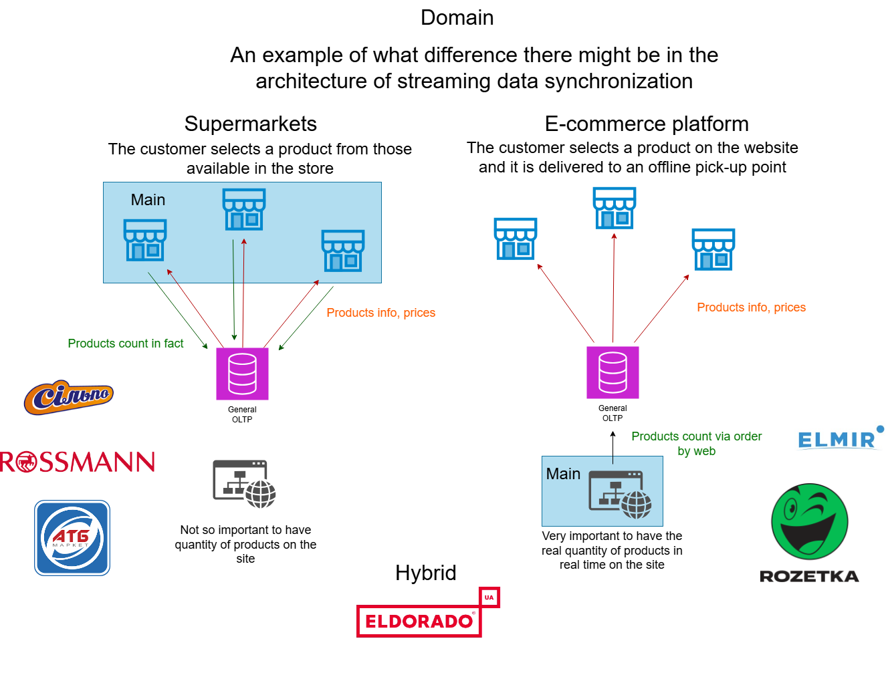
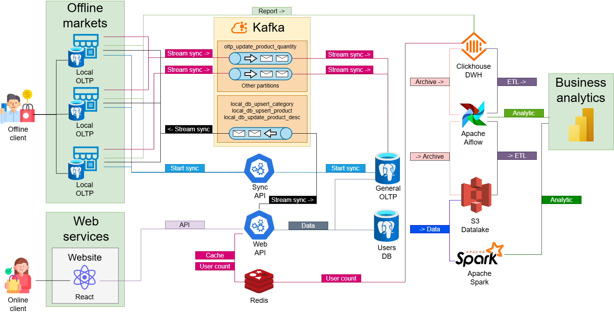
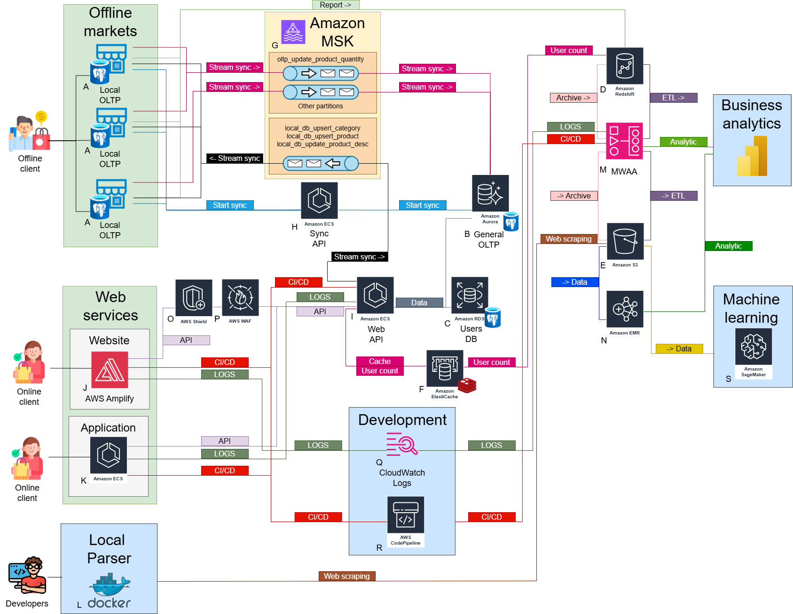
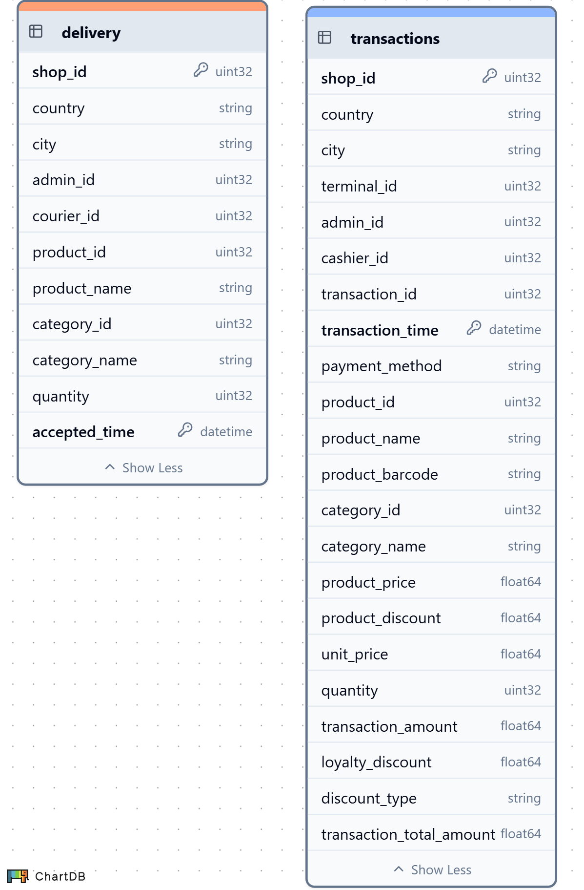

<!-- omit in toc -->
## Services
[](#)
[](#)
[](#)
[](#)

<!-- omit in toc -->
## Table of Contents
- [Introduction](#introduction)
- [Project Workflow](#project-workflow)
  - [Domain](#domain)
  - [Local Schema](#local-schema)
  - [Cloud Schema](#cloud-schema)
- [Docker Containers](#docker-containers)
- [ClickHouse Schema](#clickhouse-schema)
- [Getting Started](#getting-started)
- [Next Section of the Project](#next-section-of-the-project)

## Introduction
🟢 **This is part 1 of 7 Docker sections in the [🔴 Supermarket Simulation Project](https://github.com/SerhiiDolhopolov/rossmann_services).**

This project is the final task for the Big Data Infrastructure Technologies course at [BigDataLab](https://www.bigdatalab.com.ua/).
The goal of the project is to build the architecture of the [Rossmann supermarket](https://www.rossmann.de/de/), demonstrate the architecture's operation locally, and create a diagram of cloud technologies.

## Project Workflow
### Domain
[Rossmann's](https://www.rossmann.de/de/) business model focuses on offline customers who generate the main revenue. The web environment serves as a supplementary channel. Real-time data is not critical, as products are non-unique; therefore, inventory updates can be sent periodically to ensure timely restocking.
<table>
  <tr>
    <th style="width: 120px; border-right:2px solid grey;">Criterion</th>
    <th>Supermarket (Rossmann)</th>
    <th>Marketplace (Rozetka, Elmir)</th>
  </tr>
  <tr>
    <td style="border-right:2px solid grey;">Main Customer</td>
    <td>Offline, purchases on the spot</td>
    <td>Online, picks up orders at a collection point</td>
  </tr>
  <tr>
    <td style="border-right:2px solid grey;">Importance of Stock Data</td>
    <td>Low: products are not unique</td>
    <td>High: products may be rare or limited</td>
  </tr>
  <tr>
    <td style="border-right:2px solid grey;">Stock Management</td>
    <td>Managed locally by stores</td>
    <td>Managed centrally by the server</td>
  </tr>
</table>

This highlights how business architecture and data needs can vary significantly, even within seemingly similar sectors.



### Local Schema
The diagram was created at [draw.io](https://app.diagrams.net/)


### Cloud Schema
The diagram was created at [draw.io](https://app.diagrams.net/)


## Docker Containers
**This docker section includes:**
  - [Adminer](https://www.adminer.org/en/) to view SQL databases. 
    - 🌐 Web interface: 
      - [localhost:1000](http://localhost:1000) 

  - [Minio S3](https://min.io/) as a data lake
    - 🌐 Web interface: 
      - [localhost:1101](http://localhost:1101)
  - [ClickHouse](https://clickhouse.com/) as a DWH
  - [ch-ui](https://ch-ui.com/) to view ClickHouse
    - 🌐 Web interface: 
      - [localhost:1202](http://localhost:1202)
  - [Kafka](https://kafka.apache.org/) as a message broker

## ClickHouse Schema
TTL of records = 4 months.

Partitions by month of accepted_time/transaction_time.



## Getting Started
**To start:**
1. Run the command below to create a network. Thanks to the network, docker containers will see each other. (Execute only once)
```bash
docker network create --driver bridge rossmann-network
```
2. Restore the S3 volume with product images (Execute only once):
```bash
docker run --rm -v minio-data:/data -v ${PWD}:/backup busybox tar -xzf /backup/minio-data.tar.gz -C /data
```
3. Run services:
```bash
docker compose up --build
```

## Next Section of the Project

[Rossmann OLTP](https://github.com/SerhiiDolhopolov/rossmann_oltp)

